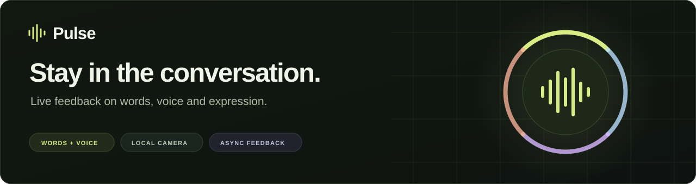
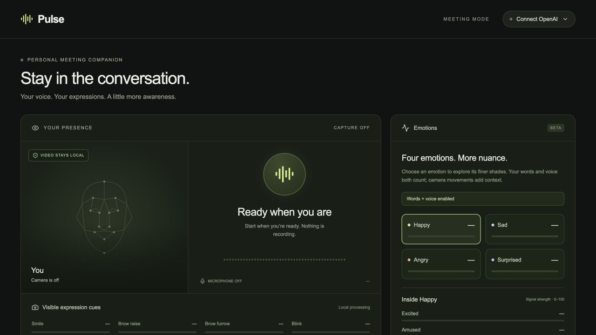
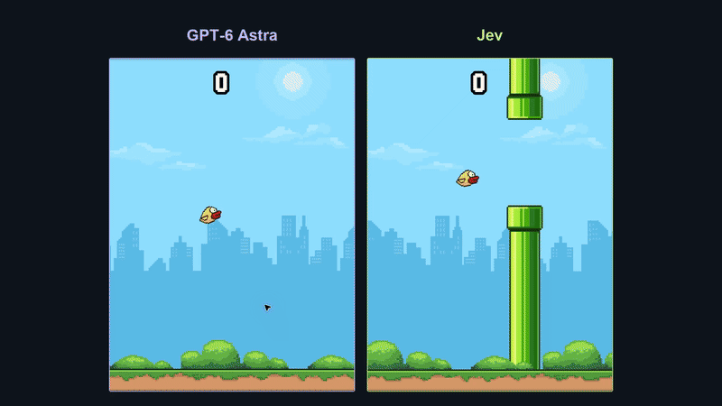
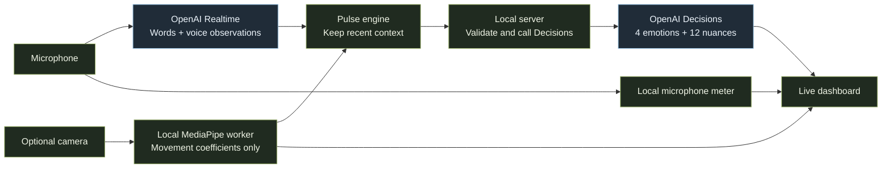
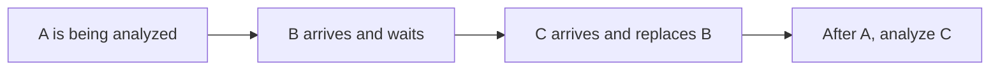

<p align="center">
  
</p>

<p align="center">
  <strong>Live feedback on what you say and how you say it.</strong><br />
  React · TypeScript · OpenAI Realtime + Decisions · MediaPipe
</p>

<p align="center">
  <a href="#what-it-does">Overview</a> ·
  <a href="#the-flappy-bird-comparison">Flappy Bird video</a> ·
  <a href="#how-it-works">How it works</a> ·
  <a href="#run-it">Run it</a>
</p>

## What it does

Pulse is a separate dashboard that runs alongside your call. It combines your **words**, **tone of voice**, and optional **camera movement cues** to show what you are expressing as you speak.



*The actual interface, with microphone and camera off.*

- **Four emotions, more detail.** Start with Happy, Sad, Angry, and Surprised. Open each to explore three finer shades.
- **Your words count.** Clear emotional wording can register even when your voice is calm or your face is neutral.
- **Feedback keeps moving.** Local microphone and camera feedback continue while AI analysis runs in the background.
- **You can see the evidence.** The dashboard shows the words heard, voice observations, and processing times.
- **Your camera stays local.** Only movement coefficients can be sent for analysis; camera frames stay on your device.

| Emotion | Finer shades |
| --- | --- |
| Happy | Excited · Amused · Content |
| Sad | Down · Disappointed · Hurt |
| Angry | Annoyed · Frustrated · Furious |
| Surprised | Amazed · Confused · Curious |

Pulse is an experimental expression tracker, not a reliable measurement of someone's inner feelings or a micro-expression detector. Unclear results stay neutral or show **—**. Facial movement alone never produces an emotion reading.

## The Flappy Bird comparison

A small illustration of a big design choice: **let code handle continuous control, and ask AI for focused decisions.**

[](https://github.com/atharvasindwani23/pulse/raw/refs/heads/main/docs/media/flappy-bird-astra-vs-jev.mp4)

**[▶ Watch GPT‑6 Astra vs Jev](https://github.com/atharvasindwani23/pulse/raw/refs/heads/main/docs/media/flappy-bird-astra-vs-jev.mp4)** · 10 seconds · silent · 2× speed

In this demo, Astra interacts through browser controls. The Jev setup reads exact game state, simulates possible flight plans, asks Jev to choose one, and lets local code time the flaps.

Pulse uses the same principle: local code keeps the interface responsive while AI interprets the conversation.

<details>
<summary>A note on the comparison</summary>

These are independent recordings with different control setups, not a controlled model benchmark or a test of OpenAI Decisions. Jev has structured game state and a local planner. Its recording begins mid-flight. Astra's side shows two complete attempts, then holds the final game-over frame while Jev continues. Both recordings play at 2× speed. The game controller is not part of this repository.

</details>

## How it works

**Realtime listens. Decisions scores. The browser keeps everything moving.**



Audio streams to Realtime over WebRTC. It returns the current phrase and a description of vocal delivery. Decisions receives that text plus optional camera coefficients and returns structured scores. The local server handles API authentication and validates responses.

### Why it feels live

The microphone meter updates roughly every **50 ms**. AI analysis uses approximately **one-second audio segments** with up to **four seconds of recent context**, so it can understand more than an isolated fragment.

When a request is still running, Pulse keeps only the newest waiting observation:



This prevents a growing backlog. Results older than five seconds are discarded, and local feedback continues if AI fails. AI interpretation still takes time; the local update rate is not an end-to-end latency guarantee.

## Why these APIs?

| Tool | Its job | Used here? |
| --- | --- | --- |
| **OpenAI Realtime** | Understand live microphone audio and describe words and delivery | Yes — `gpt-realtime-2.1` by default |
| **OpenAI Decisions** | Turn evidence into named scores the interface can use directly | Yes — `gpt-6-luna`, 16 scores in one request |
| **TypeSafe / Jev** | Make focused, typed judgments from text or structured state | An alternative scoring layer; not currently connected |

The split keeps listening separate from scoring. It also lets code check uncertain or invalid answers instead of treating every model response as a confident result.

Decisions accepts text and images; Jev accepts text/structured state. Neither replaces the audio listening stage in this design. Pulse sends Decisions **words, voice descriptions, and numeric camera cues**, never raw audio or camera frames. Switching to Jev would require an adapter and the same audio pipeline, not just a different API key.

See the official [OpenAI Decisions guide](https://developers.openai.com/api/docs/guides/decisions) and [TypeSafe / Jev documentation](https://docs.typesafe.ai/concepts/system-one).

## Run it

Use **Node.js 24** and **Chrome**.

```sh
git clone https://github.com/atharvasindwani23/pulse.git
cd pulse
npm ci
npm run dev -- --host 127.0.0.1 --port 5173 --strictPort
```

Open **http://127.0.0.1:5173/meeting**.

1. Choose **Try local feedback** to test the microphone and optional camera without AI calls.
2. Add your own OpenAI API key under **Connect OpenAI**, then choose **Start live analysis**. Your account needs access to Realtime and Decisions. Server configuration is also supported through [`.env.example`](.env.example).
3. Keep **Use spoken words** on to include meaning as well as delivery. **Stop capture** releases the microphone and camera and cancels pending analysis.

## Data and limits

- The dashboard key stays in tab memory and clears on reload. Optional server keys belong in environment variables.
- Live analysis sends microphone audio to OpenAI. Turning off **Use spoken words** excludes recognized words from scoring and display; Realtime still hears the audio.
- Camera frames stay local. Pulse does not save audio, video, transcripts, or session history to disk.
- Pulse uses your selected microphone. It does not read another app's notes, recordings, databases, or system audio.
- Provider processing and charges follow your API account's settings. Keep this local prototype on loopback unless you add authentication for deployment.

## For developers

```sh
npm test
npm run typecheck
npm run build
```

The main pieces are the [dashboard](app/meeting/), [capture and scheduling engine](lib/meeting-engine.ts), [scoring and validation rules](lib/meeting-protocol.ts), and [API routes](app/api/openai/). [Tests](tests/) cover application behavior and synthetic scenarios; they do not establish emotion-recognition accuracy on live conversations.
